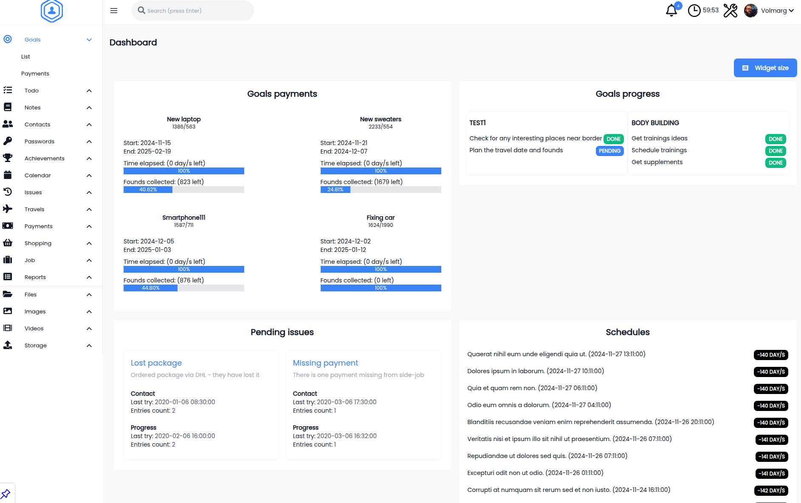
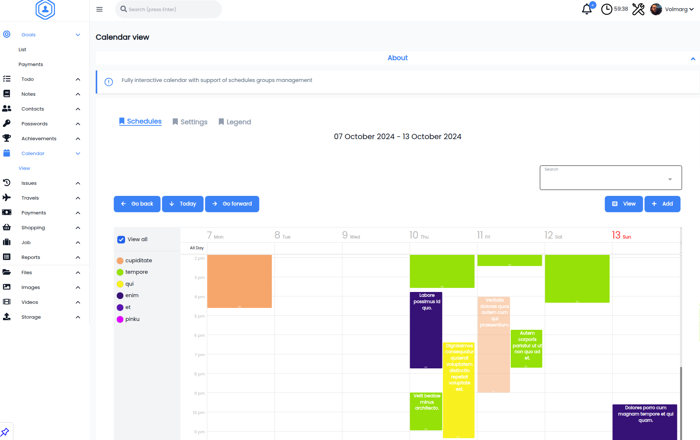

<h1 align="center"> Personal Management System Frontend</h1>

<i>This is only an interface (frontend) read below!.</i>

<h3>Documentation / Demo</h3>

<ul>
<li><b>Backend</b> - available <a href="https://github.com/Volmarg/personal-management-system"><b>here</b></a></li>
<li><b>Documentation</b> - available <a href="https://volmarg.github.io"><b>here</b></a></li>
<li><b>Demo</b> - click <a href="http://personal-management-system.pl/"><b>here </b></a>
<ul>
<li><b>Login:</b> admin</li>
<li><b>Password/LockPassword:</b> admin</li>
</ul>
</li>
</ul>

 

 

