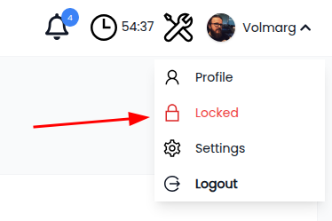
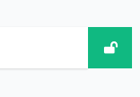
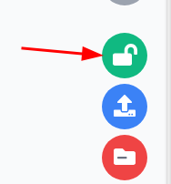

# Lock mechanism

## What is lock mechanism?

Lock mechanism can be simply called **second level authentication**, where certain modules data is hidden behind
additional authentication logic.

Imagine a case:
- You want to use the project daily, but there is some very private data which nobody should randomly see,
- You create lock for the `sensitive data` and now during normal usage nobody sees anything behind Your back,
- If You'd like to access Your locked data You simply have to provide second credentials in the top-bar user menu,

## How does it work

Locks is simply an entry stored inside the database table `locked_resource`, and can represent:
- any module related entity (record id),
- file/directory path,

## How to toggle project-wide lock

- click on the top-bar user menu, then click on the `Locked` text

## How to lock / unlock records

Depending on the module there will be a lock button, just click on it to (un)lock the record.

**Examples**

::: tip
Logically speaking if You'll lock record with project-wide lock being turned off, the record will become hidden.
:::

## Limitations

- not all modules have this feature implemented,
- there is no **auto toggle lock off during inactivity**,